<div align="center">



[](https://rubygems.org/gems/schema_reaper)
[](https://rubygems.org/gems/schema_reaper)
[](https://github.com/aksshatt/schema_reaper/actions/workflows/main.yml)
[](LICENSE.txt)

-336791?logo=postgresql&logoColor=white)

| ⚡ [Quickstart](#quickstart) | ⚙️ [Usage](#usage) | 🤖 [Production automation](#production-automation) | 🔍 [Analyzers](#analyzers) | 🛡️ [Safety model](#safety-model) | ✅ [CI](#ci) | 🧩 [Configuration](#configuration) | 💼 [Pro](#pro-for-teams) |
|:---:|:---:|:---:|:---:|:---:|:---:|:---:|:---:|

</div>

`schema_reaper` reads your **live PostgreSQL schema and planner statistics** and
cross-references them against a **static scan of your codebase** (Ruby via the
Prism AST, plus views and SQL string literals). Optionally it also fuses in a
**runtime signal** — a sampled log of which columns are actually read in
production. Every finding is scored by confidence and severity, carries an
estimate of the disk it reclaims, and comes with a concrete fix.

It finds three kinds of schema debt:

- **Dead weight** — columns and tables nothing references any more
- **Index trouble** — indexes nobody queries, indexes a wider one already covers, foreign keys with no index at all
- **Degenerate data** — columns that are always `NULL`, or hold the same value in every row

## Quickstart

```ruby
# Gemfile
gem "schema_reaper"
```

```sh
bundle install
bundle exec schema_reaper scan
```

In a Rails app that's it — the connection comes from `config/database.yml`.
You get a report like this:

<p align="center">
  
</p>

> [!TIP]
> Scan a database that has served real traffic — a production read-replica or a
> recent snapshot. `unused_index` needs query history (it skips itself on a
> fresh database and tells you why), and the data analyzers read `pg_stats`,
> which PostgreSQL only fills in after `ANALYZE`.

## How it works

<picture>
  <source media="(prefers-color-scheme: dark)" srcset="docs/assets/pipeline-dark.svg">
  
</picture>

Findings that say the same thing about different tables are rolled up into one
entry; when several analyzers flag the same column, the strongest finding wins
and notes the others that agreed. `schema_reaper` never changes your database —
it only reads, and hands you migrations to review.

## Install

```ruby
# Gemfile
gem "schema_reaper"
```

Requires Ruby >= 2.7 (CI-tested on 2.7 – 3.3) and PostgreSQL. Rails is optional
for the CLI; the rake tasks and production automation need Rails, and the
runtime tracker needs ActiveRecord.

> [!IMPORTANT]
> **Only scanning locally or in CI?** Scope it out of your production bundle:
> `gem "schema_reaper", group: :development`.
>
> **Planning to use [production automation](#production-automation)?** Leave it
> unscoped. Most deploys exclude the development and test groups
> (`BUNDLE_WITHOUT=development:test`), so a dev-scoped gem is simply absent when
> the scheduled scan tries to run. The install generator warns you about this.

<details>
<summary><b>How the database connection is resolved</b></summary>

<br>

1. `database_url:` in `.schema_reaper.yml`
2. `ENV["DATABASE_URL"]`
3. `config/database.yml` for the current environment (`SCHEMA_REAPER_ENV`, then
   `RAILS_ENV`, then `RACK_ENV`, default `development`) — ERB and YAML aliases
   are handled, as are Rails 6+ multi-database sections (the `primary` entry is
   used)

</details>

## Usage

```sh
bundle exec schema_reaper scan                    # grouped terminal report
bundle exec schema_reaper scan --format markdown  # PR-comment table
bundle exec schema_reaper scan --format sarif     # GitHub code scanning
bundle exec schema_reaper scan --format json
bundle exec schema_reaper scan --ci               # exit 1 on findings not in the baseline
bundle exec schema_reaper scan --min-confidence 0.8
bundle exec schema_reaper baseline                # accept current findings
bundle exec schema_reaper trend                   # snapshot + progress delta
bundle exec schema_reaper generate-migration users legacy_api_token
```

<details>
<summary><b>All <code>scan</code> options</b></summary>

<br>

| option | default | what it does |
|---|---|---|
| `--format` | `table` | `table`, `json`, `markdown` or `sarif` |
| `--ci` | off | exit 1 when a finding isn't in `.schema_reaper/baseline.json` |
| `--min-confidence N` | `0.0` | hide findings below this confidence (0.0 – 1.0) |
| `--record` | off | also append this run to the history log used by `trend` |
| `--color` / `--no-color` | auto | force colour on or off for the table report |
| `--config PATH` | `.schema_reaper.yml` | config file to load (works on every command) |

Colour is automatic on a terminal, and off when output is piped or `NO_COLOR` is set.

</details>

<details>
<summary><b>Rake tasks (Rails)</b></summary>

<br>

The railtie adds these to any Rails app with the gem in its bundle:

| task | what it does |
|---|---|
| `rake schema_reaper:scan` | same as `schema_reaper scan`; pick a format with `FORMAT=json` etc. |
| `rake schema_reaper:baseline` | write the current findings to the baseline file |
| `rake schema_reaper:trend` | record a snapshot and print the trend |
| `rake schema_reaper:alert` | run one production scan and send the report — what the [schedule](#production-automation) calls |

</details>

## Production automation

*New in v2.0.* Run `schema_reaper` unattended in production and have the report
land in your team's chat and inbox — no DevOps ticket, and no server access
beyond a normal deploy.

```sh
bin/rails generate schema_reaper:install
```

| generated | purpose |
|---|---|
| `config/initializers/schema_reaper.rb` | where reports go (webhook and/or email) |
| an entry in `config/schedule.rb` **or** `config/schedule.yml` | the quarterly scheduled scan (whenever or sidekiq-cron) |
| `app/controllers/schema_reaper_controller.rb` + a route | a token-protected "scan now" endpoint |
| a trigger token, printed once | you paste it into your encrypted credentials |

Re-running the generator is safe: every step checks for its own marker and
skips itself rather than duplicating anything. Commit the files, deploy, and
check it works end to end with one manual run in production:

```sh
bin/rails schema_reaper:alert
```

### 1. Where reports go

The generated initializer is commented out, so an unfilled config is a safe
no-op, not an error. Uncomment one or both:

```ruby
SchemaReaper::AlertConfig.configure do |config|
  # config.emails = %w[dev1@example.com dev2@example.com]
  # config.webhook_url = "https://hooks.slack.com/services/T000/B000/XXXX"
end
```

Both channels fire when both are set — not a fallback chain, but two audiences:
a dev-facing chat channel, and an inbox record for people who don't watch chat.

- **Webhook** — a Slack-compatible `{"text": "..."}` JSON POST carrying the
  Markdown report, with a 10-second timeout.
- **Email** — sent by `SchemaReaper::Mailer`, which inherits your app's
  `ApplicationMailer` (its `default from:`, delivery settings and so on), or
  `ActionMailer::Base` if you don't have one. Delivered with `deliver_later`.

Delivery failures are logged with a `[schema_reaper]` prefix and never raised,
so a flaky endpoint can't fail or retry-storm the scan.

### 2. The schedule

The generator looks at your `Gemfile.lock` and uses whichever scheduler you
already run. The default cadence is **quarterly**; edit the generated entry to
change it.

| you use | the generator adds | also needed |
|---|---|---|
| [whenever](https://github.com/javan/whenever) | an `every 3.months` block running `rake "schema_reaper:alert"` in `config/schedule.rb` | whenever only writes your crontab when `whenever --update-crontab` runs on the server — usually via its Capistrano recipe. Platforms without a crontab (Heroku, most container hosts) need one of the other rows. |
| [sidekiq-cron](https://github.com/sidekiq-cron/sidekiq-cron) | a `schema_reaper_scan` entry in `config/schedule.yml` (`0 4 1 */3 *` — 04:00 on the 1st, every 3 months) that enqueues `SchemaReaper::ScanJob` | nothing — sidekiq-cron ≥ 1.6 loads `config/schedule.yml` automatically |
| neither | nothing — it prints the command instead of guessing | point any scheduler (cron, Heroku Scheduler, a Kubernetes CronJob) at `bin/rails schema_reaper:alert` |

`rake schema_reaper:alert` enqueues the scan on your ActiveJob backend. If that
backend is Rails' in-process `:async` adapter (the default before Rails 8 unless
you've set one up), the job would die with the short-lived rake process — so
the task runs the scan inline instead, email included.

### 3. The manual trigger

For "scan now" without shelling into a box:

```sh
curl -X POST https://your-app.example.com/internal/schema_scan \
  -H "Authorization: Bearer <token>"
```

| response | meaning |
|---|---|
| `202 Accepted` | scan enqueued — the report arrives through the channels above |
| `401 Unauthorized` | missing or wrong token, or no token configured in this environment |
| `429 Too Many Requests` | a scan was already triggered in the last 5 minutes |

The generator prints the token once, with the exact snippet to paste into
`bin/rails credentials:edit`:

```yaml
schema_reaper:
  trigger_token: <token>
```

Credentials are decrypted with the `RAILS_MASTER_KEY` your app already has, so
this adds no new production configuration. The token is checked with a
constant-time comparison. The controller deliberately doesn't inherit your
`ApplicationController` and skips CSRF (it's a token-authenticated API endpoint,
not a form), so your own auth filters don't apply to it.

> [!NOTE]
> The 5-minute cooldown lives in `Rails.cache`, so it's only as shared as your
> cache store. Redis, Memcached or Solid Cache give one cooldown for the whole
> app; a file or memory store gives one per host or process; `:null_store`
> turns it off.

### 4. Install-time warnings

Two misconfigurations would otherwise fail silently much later, so the
generator flags them when it runs:

- the gem is scoped to `group: :development` — the scheduled scan would never
  run in production
- neither `ApplicationMailer` nor `config.action_mailer.default_options` sets a
  `from:` address — the mailer would fall back to a placeholder sender that most
  SMTP relays reject, so email reports would never arrive

> [!WARNING]
> **Still on 2.0.0?** Two production-automation bugs are fixed on `main` and
> ship in the next release:
> - Report emails ignore `ApplicationMailer` and are sent from
>   `schema_reaper@localhost`. Work around it by adding
>   `SchemaReaper::Mailer.default from: "you@your-domain.com"` to
>   `config/initializers/schema_reaper.rb`.
> - With the `:async` ActiveJob adapter, `rake schema_reaper:alert` enqueues a
>   job that never runs. Use a persistent backend (Sidekiq, GoodJob, Solid
>   Queue, …) for the whenever and plain-cron paths.

<details>
<summary><b>Why not just run it in CI?</b></summary>

<br>

[`--format sarif` in CI](#ci) is for PR- and staging-level checks. GitHub-hosted
runners have no network path to your production database by default, and a CI
database has no production traffic statistics. Production automation is the path
for watching the real, live database.

</details>

## Analyzers

| type | what it flags | main signal |
|---|---|---|
| `dead_column` | column no code path references | static scan (+ runtime) |
| `dead_table` | table with no model or query reference | static scan + row count |
| `unused_index` | non-unique index with `idx_scan = 0` (needs query history) | `pg_stat_user_indexes` |
| `duplicate_index` | index that exactly duplicates another, or is a prefix of a wider one | schema shape |
| `missing_fk_index` | `*_id` / foreign-key column with no index (polymorphic pairs need a `(type, id)` index) | schema shape |
| `always_null_column` | `null_frac = 1.0` — no data at all | `pg_stats` |
| `single_value_column` | one distinct value on a table of 500+ rows | `pg_stats` |

Columns and tables owned by common gems are whitelisted automatically when the
gem is in your bundle: **devise**, **devise-api**, **paper_trail**,
**audited**, **friendly_id**, **paranoia** / **acts_as_paranoid**,
**activestorage**, **actiontext**, **pg_search**, **ahoy_matey** and
**activeadmin**.

## Runtime signal (optional, raises confidence)

Static analysis alone can't see metaprogrammed access, so `dead_column`
confidence is capped at **0.6** without runtime data. To lift the cap, sample
real column reads:

```ruby
# config/initializers/schema_reaper_tracker.rb
SchemaReaper::Runtime::Tracker.install!(
  store: SchemaReaper::Runtime::Store.new(path: ".schema_reaper/runtime.jsonl"),
  sample_rate: 0.05
)
```

or, in Rails, boot with `SCHEMA_REAPER_TRACK=1` (and optionally
`SCHEMA_REAPER_SAMPLE=0.05` for the sample rate). Let it run in staging or
production for a couple of weeks. A column unseen in **both** code and
≥ 14 observed days of runtime data reaches **0.9** confidence (0.8 if it's
`NOT NULL`).

> [!NOTE]
> This is separate from [production automation](#production-automation): the
> tracker raises confidence in the findings a scan already makes, while
> production automation runs the scan on a schedule and delivers the report.
> Most teams want both.

## Safety model

`schema_reaper` never drops anything itself. For a dead column,
`generate-migration users legacy_api_token` writes a pair:

1. **`…_ignore_users_legacy_api_token.rb`** — a no-op migration that reminds
   you to add `self.ignored_columns += %w[legacy_api_token]` to the model. Deploy
   that. Nothing is dropped; ActiveRecord just stops selecting the column.
2. **`…_drop_users_legacy_api_token.rb`** — the `remove_column`. Run it only
   after step 1 has soaked in production and nothing broke. Its `down` raises
   `ActiveRecord::IrreversibleMigration` on purpose.

The data-driven fixes are cautious too: `always_null_column` asks you to
confirm with a `SELECT count(...)` first, `single_value_column` to check the
value isn't a meaningful default, and `dead_table` to rule out external
consumers.

## CI

```yaml
# .github/workflows/schema_reaper.yml (the relevant parts)
permissions:
  contents: read
  security-events: write          # required by upload-sarif

# ...job setup: Ruby, a PostgreSQL service, DATABASE_URL...
    steps:
      - run: bin/rails db:schema:load
      - run: bundle exec schema_reaper scan --ci --format sarif > reaper.sarif
      - uses: github/codeql-action/upload-sarif@v4
        if: always()              # upload even when --ci fails the step above
        with: { sarif_file: reaper.sarif }
```

Commit `.schema_reaper/baseline.json` (from `schema_reaper baseline`) so the job
fails only when a change adds *new* dead weight.

> [!NOTE]
> A freshly loaded CI database has no rows, statistics or query history, so CI
> catches the schema- and code-shaped findings (`dead_column`, `dead_table`,
> `duplicate_index`, `missing_fk_index`). The data-driven ones need a real
> database — that's what [production automation](#production-automation) is for.

## Configuration

Every key is optional. Drop a `.schema_reaper.yml` in the project root to
override any of these defaults:

<details>
<summary><b>.schema_reaper.yml — all keys with their defaults</b></summary>

<br>

```yaml
database_url:          # falls back to DATABASE_URL, then config/database.yml
database_yml: config/database.yml
scan_paths: [app, lib, config]
view_globs: ["app/**/*.erb", "app/**/*.haml", "app/**/*.slim", "app/**/*.jbuilder"]
ignore:
  tables: [schema_migrations, ar_internal_metadata]
  columns: []          # exact names, or "/regex/" patterns
always_keep_columns: [id, created_at, updated_at, type]
gem_awareness: true    # auto-whitelist columns owned by known gems
min_age_days: 14
runtime_log: .schema_reaper/runtime.jsonl
history_log: .schema_reaper/history.jsonl
baseline: .schema_reaper/baseline.json
require: []            # extra files to load, e.g. custom analyzers
```

</details>

### Custom analyzers

```ruby
# lib/schema_reaper/analyzers/my_check.rb
class MyCheck < SchemaReaper::Analyzers::Base
  SchemaReaper::Analyzers::Registry.register(self)

  def call
    schema.tables.filter_map { |t| ... finding(type: :my_check, table: t.name, ...) }
  end
end
```

```yaml
# .schema_reaper.yml
require:
  - lib/schema_reaper/analyzers/my_check.rb
```

## Roadmap

> [!TIP]
> ✅ Self-hosted scheduled scans + alerts shipped in **v2.0** — see
> [Production automation](#production-automation).

- Runtime verdict fusion for index and table findings
- Orphan-row and `schema.rb`↔DB drift analyzers
- Disk/$ reclaim from real `pg_total_relation_size`
- Mountable dashboard engine, trend charts
- MySQL adapter

## Pro (for teams)

The gem is free and complete for a single app — including the scheduled scans
and alerts above. **schema_reaper Pro** adds the team-scale layer: MySQL
adapter, multi-database fan-out, orphan-row and schema-drift analyzers, native
Slack/Jira/PR-comment reporters, real `pg_total_relation_size` + $ estimates, a
hosted zero-install scan runner, and a mountable dashboard engine. See
[PRO.md](PRO.md). Waitlist / early access: open an issue tagged `pro`.

## Sponsor

`schema_reaper` is MIT and maintained in the open. If it saved you disk, money,
or a nasty migration, sponsor its development via the **Sponsor** button on the
repo.

## Development

```sh
bin/setup
bundle exec rake        # rspec + rubocop

# opt-in: live-database introspection specs
SCHEMA_REAPER_TEST_DATABASE_URL=postgres://localhost/schema_reaper_test bundle exec rspec
```

## License

[MIT](LICENSE.txt).
